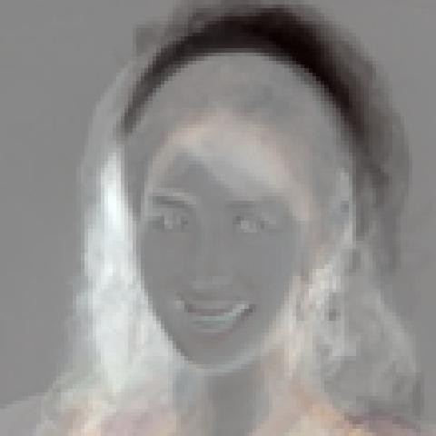
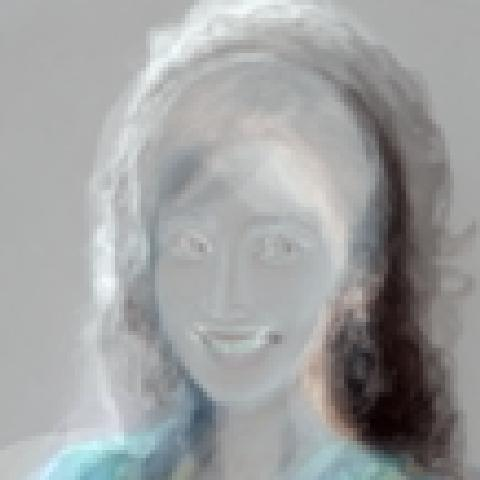
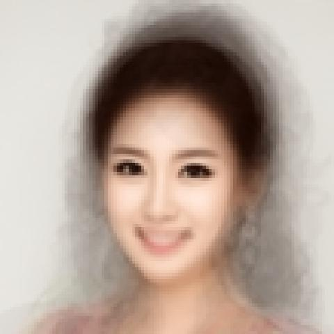
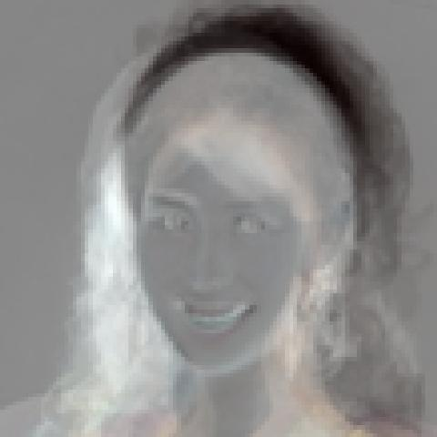

# Facial Recognition of Miss Koreans

Built an Eigen-face to represent the 20 most beautiful Korea ladies with principle component analysis

## Principle Component Analysis Function

```
pcafun = function(x){
  c = ( t(x)-apply(x,2,mean) ) %*% t( t(x)-apply(x,2,mean) )
  ei = eigen(c)$value
  eiv = eigen(c)$vector
  return( list(ei,eiv))
}
```


### Eign-face 1 (With Centering)

Create an eign face by the first priciple component

```
library(grid)
comp=pca1$rotation[,1]
#comp=abs(comp)
comp=(comp-min(comp))/(max(comp)-min(comp))
r=matrix(comp[1:(109*109)], nrow=109)
g=matrix(comp[(109*109+1):(109*109*2)], nrow=109)
b=matrix(comp[(109*109*2+1):(109*109*3)], nrow=109)
col=rgb(r,g,b)
dim(col)=dim(r)
grid.raster(col, interpolate=FALSE)
```


repeat to create the second eign-face

```
comp=pca1$rotation[,2]
comp=(comp-min(comp))/(max(comp)-min(comp))
r=matrix(comp[1:(109*109)], nrow=109)
g=matrix(comp[(109*109+1):(109*109*2)], nrow=109)
b=matrix(comp[(109*109*2+1):(109*109*3)], nrow=109)
col=rgb(r,g,b)
dim(col)=dim(r)
grid.raster(col, interpolate=FALSE)
```


Compare with those eign-faces without centering
```
pca1<- prcomp(t(data), center=FALSE, scale=FALSE)
summary(pca1)
```

## Create an eign-face(without centering)

```
comp=pca1$rotation[,1]
comp=abs(comp)
comp=(comp-min(comp))/(max(comp)-min(comp))
r=matrix(comp[1:(109*109)], nrow=109)
g=matrix(comp[(109*109+1):(109*109*2)], nrow=109)
b=matrix(comp[(109*109*2+1):(109*109*3)], nrow=109)
col=rgb(r,g,b)
dim(col)=dim(r)
grid.raster(col, interpolate=FALSE)
```



### Create an second eign-face(without centering)

```
comp=pca1$rotation[,2]
#comp=abs(comp)
comp=(comp-min(comp))/(max(comp)-min(comp))
r=matrix(comp[1:(109*109)], nrow=109)
g=matrix(comp[(109*109+1):(109*109*2)], nrow=109)
b=matrix(comp[(109*109*2+1):(109*109*3)], nrow=109)
col=rgb(r,g,b)
dim(col)=dim(r)
grid.raster(col, interpolate=FALSE)
```


### Conclusion

1. With centering or substract by the mean will make the face become blur
2. with centering, both the proportion of variation and standard deviation decrease.

